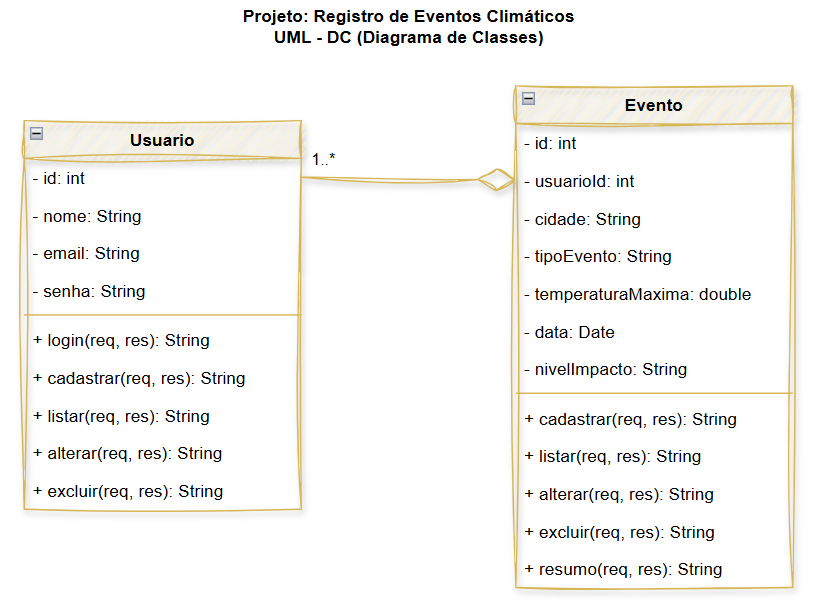
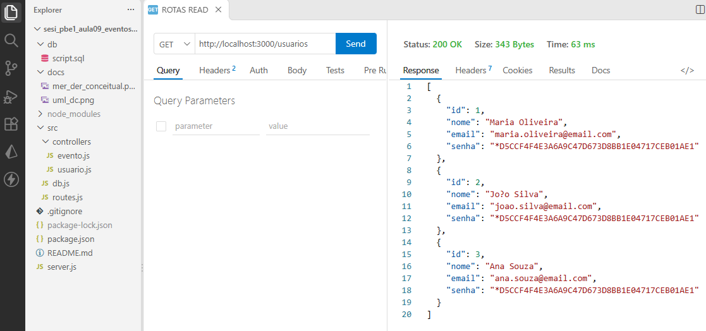
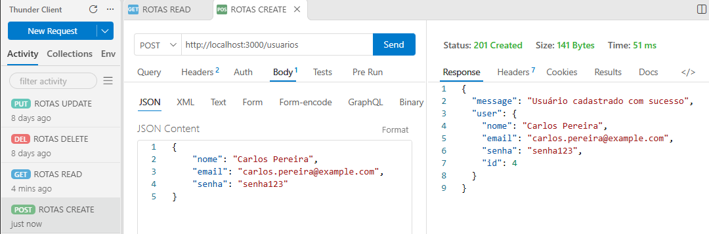
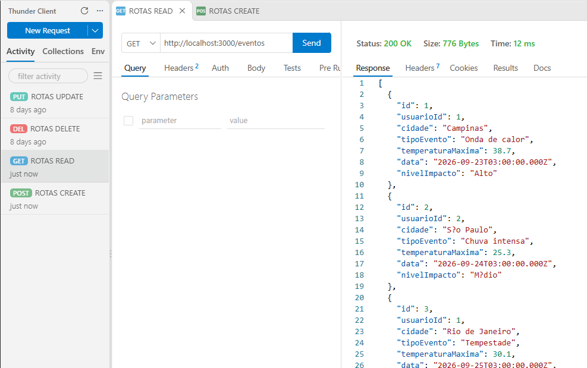
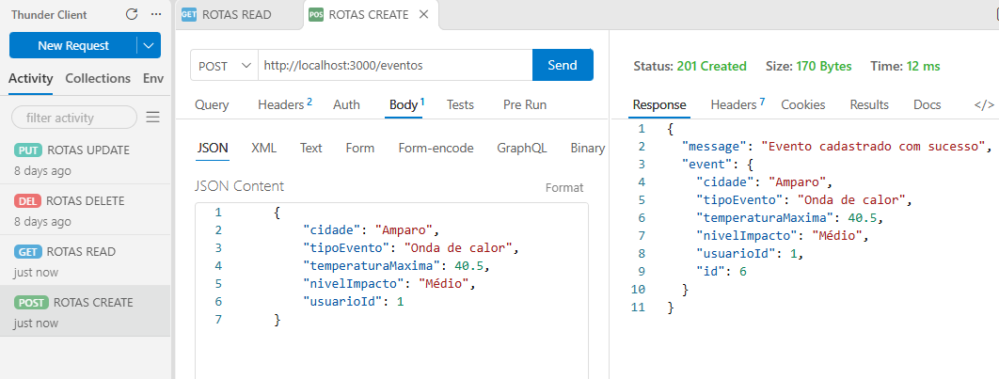

# Gestão de Eventos Climáticos
Projeto para aulas de back-end, com o objetivo de criar uma API RESTful para gerenciar eventos climáticos conectando Node.js com MariaDB. O projeto inclui funcionalidades para cadastrar, listar, atualizar e excluir eventos climáticos, bem como autenticação de usuários.
<br>
<br>

## Tecnologias utilizadas
- Node.js
- Express.js
- MariaDB (XAMPP)
- VsCode
# Instruções para testar
- 1 Clonar o repositório
- 2 Instalar as dependências com `npm install`
- 3 Configurar o banco de dados MariaDB com as tabelas necessárias
    - Abra o XAMPP de start no Mysql, abra o **Shell** acesse o MariaDB com o comando:
    ```bash
    mysql -u root
    ```
    - Copie e cole o conteúdo do arquivo `db/script.sql` no shell do MariaDB para criar e popular o banco de dados.
- 4 Iniciar o servidor com `npm run dev`
- 5 Testar as rotas da API utilizando o Thunder Client ou Insomnia ou Postman, conforme especificado no arquivo `src/rotes.js`.

## Testes com Thunder Client
<details><summary>Listar Usuários</summary></details>
<details><summary>Cadastrar novo usuário</summary></details>
<details><summary>Listar Eventos</summary></details>
<details><summary>Cadastrar novo Evento</summary></details>